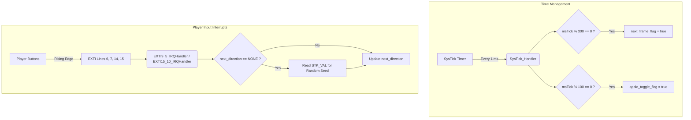
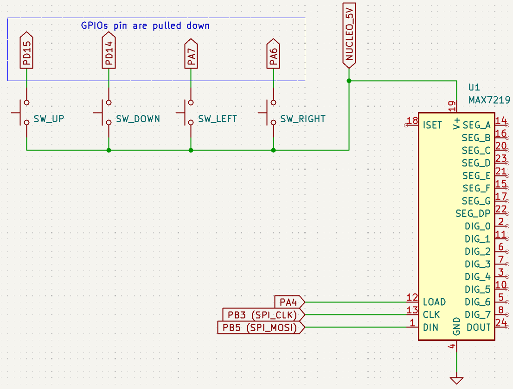

# Running Snake using an Nucleo-F446ZE and an MAX7219 8*8 dot matrix (Bare-metal)

## DISCLAIMER 
*This project is a bare-metal POC for a Snake game running on a Nucleo-F446ZE. The primary goal was to set up a working game without relying on HAL, LL APIs, or an RTOS. Consequently, memory footprint, code quality, and speed optimization were not prioritized in this first version. Improvements are being made and can be found in other branches (e.g., the `gpio-driver` branch).*

## ARCHITECTURE AND CODE EXPLANATION
### Timings & Display Rendering
The game state is rendered on an 8x8 dot matrix driven by the **MAX7219** using **SPI**.
- The main game loop updates the display every `MSEC_PER_FRAME` (set to 300 ms).
- The player's inputs are registered during a window of approximately `MSEC_PER_FRAME - 2` ms (the hardware rendering process takes roughly 2 ms)
- To help the player distinguish the apple from the snake's body, the apple's LED is toggled on and off at an `APPLE_TOGGLE_RATE` of 100 ms.

Rather than redrawing the entire 8x8 grid every frame, the display process is optimized: The snake's body coordinates are stored in a circular buffer array `Position snake[MAX_SNAKE_SIZE]`, tracked by a `head_idx` and a `tail_idx`. Regardless of the player's input, the game only updates two dots per frame: it turns off the oldest tail tile (unless an apple was just eaten) and turns on the new head tile corresponding to the chosen direction.

### Interrupts and Critical Sections
The game relies on hardware interrupts rather than a blocking loop :
* **SysTick Timer**: Generates an interrupt every 1 ms to increment `msTick` and set flags (`next_frame_flag` and `apple_toggle_flag`) for the main `while` loop.
* **EXTI Handlers**: Button presses are detected on EXTI lines 6, 7, 14, and 15, which trigger `EXTI9_5_IRQHandler` and `EXTI15_10_IRQHandler`. Each interrupt updates the `next_direction` variable.

As the game state update takes time, it is considered a **critical section**. If a button interrupt were to overwrite `next_direction` while the rendering process was actively reading it, it could cause errors. This is why the button interrupts are temporarily disabled in the NVIC registers during the rendering process :

```c
// Disable EXTI interrupts to protect the critical section
*NVIC_ICER0 |= (1U << (23 - 0));  // disable EXTI9_5
*NVIC_ICER1 |= (1U << (40 - 32)); // disable EXTI15_10

update_lightmap(); // Game state rendering process

// Re-enable EXTI interrupts
*NVIC_ISER0 |= (1U << (23 - 0));  // enable EXTI9_5
*NVIC_ISER1 |= (1U << (40 - 32)); // enable EXTI15_10
```



### Game Logic & Randomness
#### Generation of a pseudo-random position for the apple

In order to generate a random number, the first player input of a cycle samples the 24-bit SysTick current value register (``STK_VAL``). The lowest 6 bits of this value are used as a pseudo-random seed to compute the next apple's position (3 bits for the X coordinate and 3 bits for the Y coordinate).

```c
uint8_t randomX = appleRandomSeed & 0b111U;
uint8_t randomY = (appleRandomSeed >> 3) & 0b111U;
```

If the randomly generated coordinates are already occupied by the snake's body, the new apple spawns at the snake's most recent empty tail position. This trick enables a valid, empty spawn position without the memory overhead of tracking a list of empty tiles.

#### Direction Validation

The game must prevent the snake from instantly reversing into itself (e.g., trying to go ``DOWN`` while currently traveling ``UP``). This is handled using a bitwise design for the ``Direction`` enum:
```c
enum Direction {
  UP    = 0b0011U,
  RIGHT = 0b1001U,
  DOWN  = 0b1100U,
  LEFT  = 0b0110U,
  NONE  = 0b0000U
};
```
Because of the bit mappings, a bitwise AND computed on incompatible directions evaluate to zero (e.g., ``UP & DOWN == 0``, ``LEFT & RIGHT == 0``). During the update step, if ``!(next_direction & last_direction)`` is ``true``, the invalid input is ignored and the snake continues on its current path (same if no input was provided, `next_direction == NONE == 0`).

#### Collision Detection

A single 8-byte array (``snake_lightmap``) tracks the state of the entire screen. If the snake's next head position points to a bit that is already set to ``1`` in the lightmap, a self-collision occurs. The ``game_over`` flag is set, and a predefined ``GAME_OVER_FRAME`` is displayed on the dot matrix.

This enables to only check the ``snake_lightmap[next_pos.Y] & (0b10000000U >> next_pos.X)`` value, instead of veriying all the positions between the tail and head indexes in the ``snake[64]`` array.

### Hardware details
#### Switches interrupts debouncing
No debouncing mechanisms were implemented (RC filters or even software guards) because bounces were not an issue.
#### Wiring diagram


### Improvements for the next version
1. **Peripheral Drivers**: Implement dedicated drivers for **GPIO** and **SPI** peripherals to abstract direct register manipulations.
2. **SPI Optimization**: Increase the **SPI** clock frequency to reduce game state rendering time, as the **MAX7219** supports speeds up to *10 MHz*.
3. **Register Helpers**: Abstract the register-level setup for **SYSCFG**, **NVIC**, and **EXTI** into helper functions.
4. **Configuration Header**: Extract game parameters into a configuration header file for the player to modify
5. Ensure the application compiles and works properly using the **CMake** *Release build preset*.
6. **Clock Speed**: Investigate increasing the CPU clock frequency ?